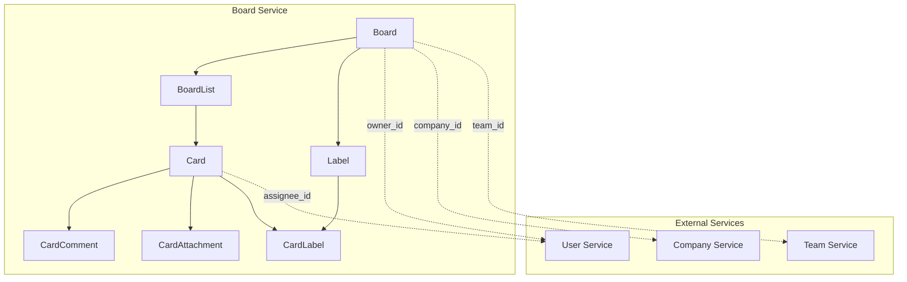

# Tasker 📋
> **Trello-like Board Management System** - Built with FastAPI, SQLAlchemy & Microservices Architecture

[](https://python.org)
[](https://fastapi.tiangolo.com)
[](https://sqlalchemy.org)
[](https://postgresql.org)

## 🚀 Overview

Tasker is a comprehensive project management system inspired by Trello, designed with microservices architecture in mind. It provides powerful board management capabilities with cards, lists, labels, comments, and file attachments - perfect for agile teams and project organization.

### ✨ Key Features

- 🏗️ **Microservices Ready** - No foreign key constraints, service-independent
- 📊 **Complete Project Management** - Boards, Lists, Cards, Labels, Comments, Attachments  
- 👥 **Team Collaboration** - Multi-user support with roles and permissions
- 🔍 **Advanced Search & Filtering** - Find cards by assignee, labels, due dates
- 📱 **REST API** - Full CRUD operations with comprehensive validation
- 🔒 **Security First** - Input validation, file size limits, access controls
- ⚡ **High Performance** - Strategic database indexing and query optimization

---

## 📊 System Architecture

### Entity Relationship Overview


### Core Models

| Entity | Purpose | Key Relationships |
|--------|---------|-------------------|
| **Board** | Main project container | → BoardList, Label |
| **BoardList** | Columns (To Do, In Progress, Done) | → Card |
| **Card** | Individual tasks/tickets | → Comment, Attachment, Label |
| **Label** | Categorization tags | ↔ Card (M:N) |
| **CardComment** | Collaboration messages | ← Card |
| **CardAttachment** | File uploads | ← Card |

---

## 🗂️ Data Models

### Board Example
```json
{
  "id": "550e8400-e29b-41d4-a716-446655440001",
  "name": "Product Development Sprint",
  "description": "Q4 2024 product development tasks and features",
  "color": "#0079bf",
  "company_id": "550e8400-e29b-41d4-a716-446655440010",
  "team_id": "550e8400-e29b-41d4-a716-446655440013",
  "owner_id": "550e8400-e29b-41d4-a716-446655440020",
  "members": ["550e8400-e29b-41d4-a716-446655440021", "550e8400-e29b-41d4-a716-446655440022"],
  "admins": ["550e8400-e29b-41d4-a716-446655440020"],
  "status": "ACTIVE",
  "visibility": "TEAM", 
  "priority": "HIGH",
  "enable_comments": true,
  "enable_attachments": true,
  "enable_due_dates": true,
  "enable_labels": true,
  "created_at": "2024-12-01T10:00:00Z",
  "updated_at": "2024-12-01T15:30:00Z"
}
```

### Board Lists (Workflow Columns)
```json
[
  {
    "id": "550e8400-e29b-41d4-a716-446655440100",
    "board_id": "550e8400-e29b-41d4-a716-446655440001",
    "name": "📋 Backlog",
    "color": "#8c8c8c",
    "position": 0,
    "card_limit": 20
  },
  {
    "id": "550e8400-e29b-41d4-a716-446655440101", 
    "board_id": "550e8400-e29b-41d4-a716-446655440001",
    "name": "🔄 In Progress",
    "color": "#f2d600",
    "position": 1,
    "card_limit": 3
  },
  {
    "id": "550e8400-e29b-41d4-a716-446655440102",
    "board_id": "550e8400-e29b-41d4-a716-446655440001", 
    "name": "👀 Review",
    "color": "#ff9f1a",
    "position": 2,
    "card_limit": 5
  },
  {
    "id": "550e8400-e29b-41d4-a716-446655440103",
    "board_id": "550e8400-e29b-41d4-a716-446655440001",
    "name": "✅ Done",
    "color": "#61bd4f", 
    "position": 3,
    "card_limit": null
  }
]
```

### Labels (Categorization)
```json
[
  {
    "id": "550e8400-e29b-41d4-a716-446655440200",
    "board_id": "550e8400-e29b-41d4-a716-446655440001",
    "name": "🐛 Bug",
    "color": "#eb5a46",
    "description": "Issues that need fixing"
  },
  {
    "id": "550e8400-e29b-41d4-a716-446655440201",
    "board_id": "550e8400-e29b-41d4-a716-446655440001", 
    "name": "✨ Feature",
    "color": "#61bd4f",
    "description": "New functionality"
  },
  {
    "id": "550e8400-e29b-41d4-a716-446655440202",
    "board_id": "550e8400-e29b-41d4-a716-446655440001",
    "name": "🔧 Enhancement", 
    "color": "#ff9f1a",
    "description": "Improvements to existing features"
  },
  {
    "id": "550e8400-e29b-41d4-a716-446655440203",
    "board_id": "550e8400-e29b-41d4-a716-446655440001",
    "name": "🚨 Urgent",
    "color": "#c377e0",
    "description": "High priority items"
  }
]
```

### Cards (Tasks/Tickets)
```json
[
  {
    "id": "550e8400-e29b-41d4-a716-446655440300",
    "list_id": "550e8400-e29b-41d4-a716-446655440101",
    "title": "🔐 Implement JWT Authentication System",
    "description": "Create secure authentication with JWT tokens, password hashing, and session management. Include login, logout, password reset, and account verification.",
    "position": 0,
    "assignee_id": "550e8400-e29b-41d4-a716-446655440021",
    "reporter_id": "550e8400-e29b-41d4-a716-446655440020", 
    "watchers": ["550e8400-e29b-41d4-a716-446655440022"],
    "status": "IN_PROGRESS",
    "priority": "HIGH",
    "due_date": "2024-12-15T18:00:00Z",
    "start_date": "2024-12-02T09:00:00Z",
    "checklist_items": 5,
    "checklist_completed": 2,
    "labels": ["Feature", "Urgent"]
  },
  {
    "id": "550e8400-e29b-41d4-a716-446655440301", 
    "list_id": "550e8400-e29b-41d4-a716-446655440102",
    "title": "🎨 Fix Login Page Responsive Design",
    "description": "Update login page styling to match design system and ensure mobile responsiveness works correctly across all devices.",
    "position": 0,
    "assignee_id": "550e8400-e29b-41d4-a716-446655440022",
    "reporter_id": "550e8400-e29b-41d4-a716-446655440021",
    "watchers": [],
    "status": "COMPLETED",
    "priority": "MEDIUM", 
    "due_date": "2024-12-05T16:00:00Z",
    "completed_at": "2024-12-01T11:30:00Z",
    "checklist_items": 3,
    "checklist_completed": 3,
    "labels": ["Bug", "Enhancement"]
  }
]
```

### Comments & Attachments
```json
{
  "comments": [
    {
      "id": "550e8400-e29b-41d4-a716-446655440500",
      "card_id": "550e8400-e29b-41d4-a716-446655440300",
      "author_id": "550e8400-e29b-41d4-a716-446655440020",
      "content": "Let's start with OAuth integration and JWT token management. We should use bcrypt for password hashing.",
      "is_edited": false,
      "created_at": "2024-12-01T11:00:00Z"
    }
  ],
  "attachments": [
    {
      "id": "550e8400-e29b-41d4-a716-446655440600", 
      "card_id": "550e8400-e29b-41d4-a716-446655440300",
      "uploader_id": "550e8400-e29b-41d4-a716-446655440021",
      "filename": "auth_requirements.pdf",
      "original_filename": "Authentication Requirements.pdf",
      "file_size": 2048000,
      "mime_type": "application/pdf"
    }
  ]
}
```

---

## 🛠️ Technical Stack

### Backend
- **Python 3.14.0** - Latest Python with enhanced performance
- **uv** - Ultra-fast Python package manager and project management tool
- **FastAPI** - Modern, fast web framework for Python APIs
- **SQLAlchemy 2.0** - Python SQL toolkit and ORM  
- **PostgreSQL** - Advanced open source relational database
- **Pydantic** - Data validation using Python type annotations
- **Uvicorn** - Lightning-fast ASGI server

### Architecture Patterns  
- **Microservices** - Service-independent design with ID references only
- **Repository Pattern** - Data access layer abstraction
- **MVC Architecture** - Models, Controllers, Routes separation
- **Dependency Injection** - FastAPI's built-in DI system

---

## 📁 Project Structure

```
tasker/
├── src/
│   ├── app.py                 # FastAPI application factory
│   ├── configs/               # Configuration management
│   │   ├── database.py        # Database connection & settings
│   │   └── app_vars.py        # Environment variables
│   ├── core/                  # Core application components
│   │   ├── factory.py         # Application factory
│   │   ├── errors.py          # Custom exceptions
│   │   └── error_handlers.py  # Global error handlers
│   ├── entities/              # SQLAlchemy models
│   │   ├── board.py           # Board entity
│   │   ├── board_list.py      # BoardList entity
│   │   ├── card.py            # Card entity
│   │   ├── label.py           # Label entity
│   │   ├── card_comment.py    # Comment entity
│   │   ├── card_attachment.py # Attachment entity
│   │   ├── card_label.py      # Card-Label association
│   │   └── enums.py           # Shared enums
│   ├── schemas/               # Pydantic validation models
│   │   ├── responses.py       # API response schemas
│   │   └── boards.py          # Board-related schemas
│   ├── modules/               # Feature modules
│   │   └── health/            # Health check endpoints
│   ├── middlewares/           # Custom middleware
│   └── utils/                 # Utility functions
├── pyproject.toml             # Python dependencies & config
├── README.md                  # This file
└── BOARD_VALIDATION_GUIDE.md  # Detailed validation guide
```

---

## 🚦 Getting Started

### Prerequisites
- Python 3.14.0+
- [uv](https://docs.astral.sh/uv/) - Ultra-fast Python package manager
- PostgreSQL 15+
- Git

### Installation

1. **Clone the repository**
```bash
git clone https://github.com/farhan-nahid/tasker.git
cd tasker
```

2. **Install dependencies and set up environment**
```bash
# uv will automatically create and manage the virtual environment
uv sync
```

3. **Configure database**
```bash
# Create .env file (copy from .env.example and modify as needed)
cp .env.example .env

# Example .env configuration:
DB_USER=postgres
DB_PASSWORD=password
DB_HOST=localhost
DB_PORT=5432
DB_NAME=tasker
PORT=8000
```

4. **Run migrations**
```bash
uv run alembic upgrade head
```

5. **Start the server**
```bash
uv run python main.py
```

> 💡 **Why uv?** uv is 10-100x faster than pip, automatically manages virtual environments, and provides better dependency resolution. All commands are prefixed with `uv run` to ensure you're using the project's environment.

### API Documentation
- **Interactive Docs**: http://localhost:8000/docs
- **OpenAPI Schema**: http://localhost:8000/redoc

---

## 📚 API Reference

### Core Endpoints

#### Boards
```http
GET    /api/v1/boards              # List user's boards
POST   /api/v1/boards              # Create new board
GET    /api/v1/boards/{id}         # Get board details
PUT    /api/v1/boards/{id}         # Update board
DELETE /api/v1/boards/{id}         # Archive board
```

#### Lists
```http
GET    /api/v1/boards/{id}/lists   # Get board lists
POST   /api/v1/boards/{id}/lists   # Create new list
PUT    /api/v1/lists/{id}          # Update list
DELETE /api/v1/lists/{id}          # Archive list
```

#### Cards
```http
GET    /api/v1/lists/{id}/cards    # Get list cards
POST   /api/v1/lists/{id}/cards    # Create new card
GET    /api/v1/cards/{id}          # Get card details
PUT    /api/v1/cards/{id}          # Update card
DELETE /api/v1/cards/{id}          # Archive card
```

---

## 🔧 Configuration

### Environment Variables
```bash
# Database Configuration
DB_USER=postgres
DB_PASSWORD=password
DB_HOST=localhost
DB_PORT=5432
DB_NAME=tasker

# Application
PORT=8000
```

---

## 🤝 Contributing

1. Fork the repository
2. Create your feature branch (`git checkout -b feature/amazing-feature`)
3. Commit your changes (`git commit -m 'Add amazing feature'`)
4. Push to the branch (`git push origin feature/amazing-feature`)
5. Open a Pull Request

### Development Guidelines
- Follow PEP 8 style guide
- Write comprehensive tests
- Update documentation for new features
- Ensure all tests pass before submitting

---

## 📄 License

This project is licensed under the MIT License - see the [LICENSE](LICENSE) file for details.

---

## 📞 Support

- **Documentation**: [docs.tasker.dev](https://docs.tasker.dev)
- **Issues**: [GitHub Issues](https://github.com/farhan-nahid/tasker/issues)
- **Discussions**: [GitHub Discussions](https://github.com/farhan-nahid/tasker/discussions)

---

<div align="center">
  <p>Made with ❤️ by <a href="https://github.com/farhan-nahid">Farhan Nahid</a></p>
  <p>⭐ Star this repo if you find it helpful!</p>
</div>